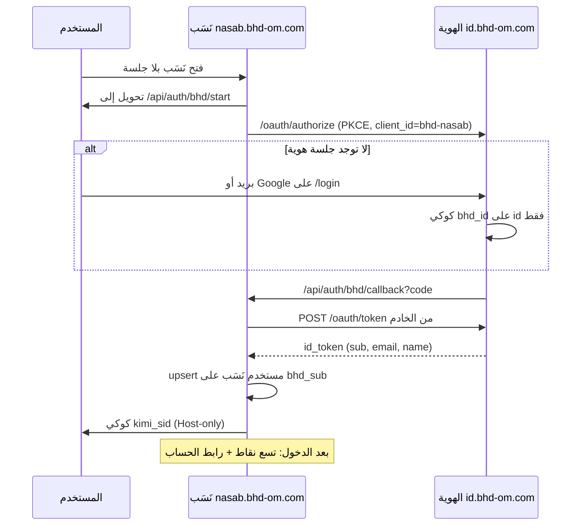

# خطة ربط نَسَب بهوية BHD ومشغّل التطبيقات

> **لمن:** مستودع [ainoamn/Nasab](https://github.com/ainoamn/Nasab)  
> **النموذج:** نفس نطاق [BHD-WAZEN-INTEGRATION.md](https://github.com/ainoamn/ONE-BHD/blob/main/docs/BHD-WAZEN-INTEGRATION.md)  
> **المصدر المعتمد للمواصفات:** [ainoamn/ONE-BHD](https://github.com/ainoamn/ONE-BHD)  
> **التاريخ:** 19 أغسطس 2026  
> **المواصفات:** `bhd-identity.v1` + `bhd-appswitcher.v1`  
> **النطاق:** توحيد **تسجيل الدخول** و**شاشة التطبيقات** فقط

نَسَب يبقى مستقلاً: الشجرات، الأعضاء، الفواتير، الاشتراكات، والأدوار المحلية **لا تُنقل ولا تُشارك**. لا تُنسخ جداول الهوية. لا تُستخدم قاعدة بيانات البوابة.

انسخ أيضاً بدون تعديل القيم المجمّدة:

- [`BHD-IDENTITY-SSO.md`](./BHD-IDENTITY-SSO.md) — نفّذ **القسم 6** حرفياً
- [`BHD-APP-SWITCHER.md`](./BHD-APP-SWITCHER.md) — نفّذ بعد نجاح الدخول

تنفيذ نَسَب للقسم 6: [`NASAB-BHD-SSO.md`](./NASAB-BHD-SSO.md).  
سياسة الأدمن وربط الأدمن القديم: [`BHD-PRODUCT-SSO-ADMIN.md`](./BHD-PRODUCT-SSO-ADMIN.md) (القسم 0.7 و4.9).

---

## 0. عقد التنفيذ (لا تتجاوزه)

1. **لا تشارك** `DATABASE_URL` مع البوابة أو وازن أو حسابي أو أي منتج.
2. **لا تضبط** `Domain=.bhd-om.com` على أي كوكي.
3. **لا تضمّن** الهوية في `iframe`. النقر ينتقل انتقالاً كاملاً.
4. **لا تضع** زر Google على واجهة نَسَب بعد الربط. جوجل على `id.bhd-om.com` فقط.
5. **لا تبنِ** تسجيل مستخدم نهائي جديد في نَسَب. التسجيل في الهوية.
6. **لا تنسخ** كلمات المرور ولا الجلسات من الهوية.
7. المعرّف المشترك الوحيد: JWT `sub` = `bhd_users.id` في الهوية = عمود `bhd_sub` في نَسَب.
8. لا تبدأ مشغّل التطبيقات قبل أن يعمل `GET /api/auth/bhd/start` بتحويل 302 إلى الهوية.
9. نَسَب **لا يحوّل** مسار الترخيص إلى أصل نَسَب. البوابة تفعل ذلك لأنها هي الهوية.

---

## 1. ماذا يُربط وكيف



بعد هذا الربط: من البوابة، اختيار نَسَب يفتح `https://nasab.bhd-om.com/api/auth/bhd/start?returnTo=/`. إن كانت جلسة الهوية قائمة لا تُطلب كلمة مرور مرة ثانية.

---

## 2. قيم مجمّدة لنَسَب — لا تغيّرها

| المفتاح | القيمة |
|---|---|
| `client_id` | `bhd-nasab` |
| Issuer | `https://id.bhd-om.com` |
| اكتشاف OIDC | `https://id.bhd-om.com/.well-known/openid-configuration` |
| الدخول | `https://id.bhd-om.com/login` |
| الحساب | `https://id.bhd-om.com/account` |
| الإنتاج | `https://nasab.bhd-om.com` |
| `redirect_uri` الإنتاج | `https://nasab.bhd-om.com/api/auth/bhd/callback` |
| `redirect_uri` Vercel | `https://nasab-mu.vercel.app/api/auth/bhd/callback` |
| `redirect_uri` محلي | `http://localhost:5173/api/auth/bhd/callback` |
| `post_logout_redirect_uri` | أصل الموقع + `/` |
| scopes | `openid profile email` |
| PKCE | `S256` إلزامي |
| جلسة المنتج | كوكي `kimi_sid` موقَّعة بـ `APP_SECRET` — خمول منزلق 48 ساعة |

---

## 3. المرحلة أ — الدخول الموحّد (منفَّذة)

- `GET /api/auth/bhd/start` يحوّل إلى `https://id.bhd-om.com/oauth/authorize` وليس إلى أصل نَسَب.
- `GET /api/auth/bhd/callback` يستبدل الرمز على الخادم ويصدر `kimi_sid`.
- عمود `bhd_sub` موجود. الربط: `bhd_sub` ثم بريد موثّق `google:`/`password:` وإلا `unionId=bhd:{sub}`.
- زر «تسجيل الدخول» يفتح `/api/auth/bhd/start` مباشرة.
- دخول المشرف يبقى `/login?admin=1`.
- الخروج يمسح `kimi_sid` ثم `/oauth/end-session`.

---

## 4. المرحلة ب — شاشة التطبيقات (هذا التنفيذ)

انسخ من مجلد النشر `BHD-Complete-Brand-and-Portal-v1.1.0/` في ONE-BHD:

| من ONE-BHD | إلى نَسَب |
|---|---|
| `app/lib/bhd/apps.ts` | `app/src/lib/bhd/apps.ts` |
| `app/components/bhd/BhdAppSwitcher.tsx` | `app/src/components/bhd/BhdAppSwitcher.tsx` |
| `app/components/bhd/BhdAppIcon.tsx` | `app/src/components/bhd/BhdAppIcon.tsx` |
| أنماط `.bhd-switcher-*` و`.bhd-app-icon` | `app/src/bhd-switcher.css` |

قواعد المشغّل:

- يظهر **فقط** بعد جلسة نَسَب صالحة (`AppHeader`).
- يسار الصورة في RTL (تسع نقاط ثم الحساب).
- رابط «الحساب» = `https://id.bhd-om.com/account` (ليست إعدادات شجرة نَسَب).
- الخروج يستدعي خروج نَسَب ثم `end-session`.
- لا تُضف تطبيقاً محلياً إلى `apps.ts`.

---

## 5. ما يفعله ONE-BHD بعد نجاح نَسَب

عندما يرد `GET https://nasab.bhd-om.com/api/auth/bhd/start` بتحويل 302 إلى `id.bhd-om.com` يُقلَب عنصر نَسَب في `lib/bhd/apps.ts` من `mode: "browse"` إلى `mode: "sso"`.

---

## 6. اختبار إلزامي

1. مستخدم جديد يسجّل على الهوية → يدخل نَسَب دون نموذج ثانٍ → صف فيه `bhd_sub`.
2. من البوابة بعد `mode: "sso"` يفتح نَسَب داخلاً إن جلسة الهوية قائمة.
3. مستخدم نَسَب قديم ببريد موثّق مطابق → لا صف ثانٍ.
4. بلا جلسة نَسَب: لا أيقونة تسع نقاط.
5. بعد الدخول: التسع نقاط، «الحساب» يفتح `https://id.bhd-om.com/account`.
6. بيانات الشجرة لم تُمس. لا طلبات إلى `DATABASE_URL` الهوية.

---

## 7. تعريف «تم»

- [x] `bhd_sub` على مستخدم نَسَب
- [x] `/api/auth/bhd/start` يحوّل إلى `id.bhd-om.com`
- [x] `/api/auth/bhd/callback` يصدر جلسة نَسَب
- [x] الخروج يمسح نَسَب ثم `end-session`
- [x] أُزيل زر Google من واجهة نَسَب
- [x] المشغّل يظهر بعد الدخول فقط
- [x] عنصر نَسَب في الكتالوج `mode: "sso"`

---

## 8. رسالة لصق لوكيل نَسَب

```text
نفّذ docs/BHD-NASAB-INTEGRATION.md كما هي.
المصدر: docs/BHD-WAZEN-INTEGRATION.md في ONE-BHD (نفس النطاق: دخول + مشغّل تطبيقات).
المواصفات: BHD-IDENTITY-SSO.md القسم 6، وBHD-APP-SWITCHER.md بعد نجاح الدخول.
النطاق: دخول موحّد + مشغّل تطبيقات فقط.
لا تشارك DATABASE_URL. لا Domain=.bhd-om.com. لا iframe. لا زر Google على نَسَب.
client_id=bhd-nasab
Issuer=https://id.bhd-om.com
redirect_uri=https://nasab.bhd-om.com/api/auth/bhd/callback
حوّل authorize وtoken إلى الهوية لا إلى أصل نَسَب.
بعد نجاح start أبلغ ONE-BHD لقلب mode نَسَب إلى sso.
```
